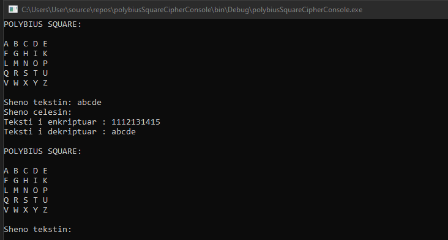
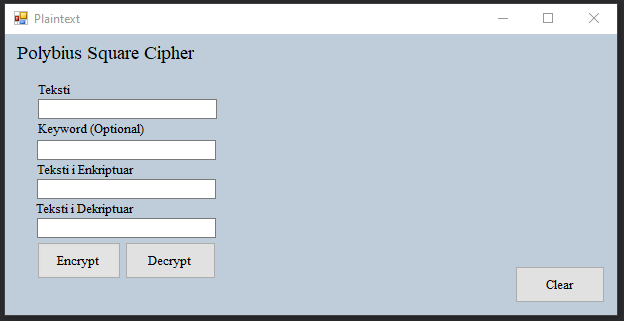
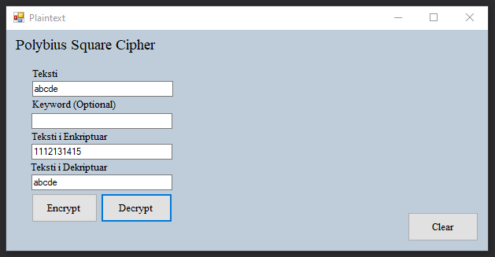
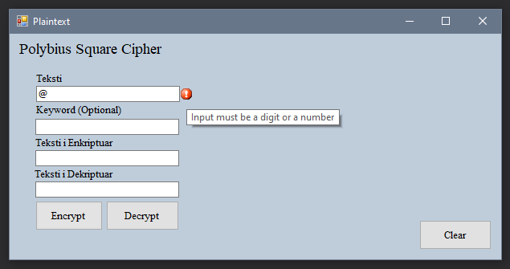
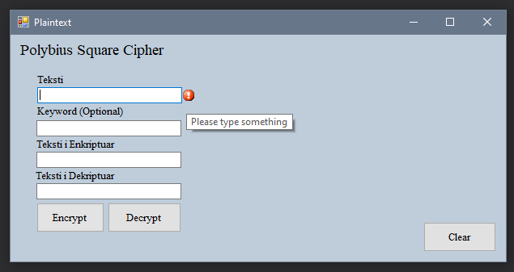

# PolybiusSquareCipher_Gr34
Projekti i pare ne lenden Siguria e te Dhenave . 

𝗛𝗬𝗥𝗝𝗔

Polybius Square është një shpikje e lashtë Greke, e zbuluar nga një studiues i quajtur Polybius. Për alfabetin grek me 24 shkronja, ai përbëhej nga një matrice 5 me 5 ku secili katror i rrjetit mbushej nga një shkronjë e vetme. Në alfabetin në gjuhën angleze me 26 shkronja, kemi një shkronjë më shumë. Për të kaluar këtë ne bashkojmë dy shkronja, tradicionalisht "i" dhe "j".
 Pajisja përdoret për fraksionimin e karaktereve të tekstit të thjeshtë në mënyrë që ato të mund të përfaqësohen nga një grup më i vogël simbolesh, i cili është i dobishëm për 
telegrafinë, steganografinë dhe kriptografinë. Pajisja u përdor fillimisht për sinjalizimin e zjarrit, duke lejuar transmetimin e koduar të çdo mesazhi, jo vetëm një sasi të caktuar opsionesh të 
paracaktuara siç ishte konventa më parë. 
Me Polybius Square  ne zëvendësojmë secilën shkronjë me dy numrat që paraqesin pozicionin e tij në matrice. Ne mund të zgjedhim nëse kalojmë përtej, ose anasjelltas, për sa kohë që e mbajmë të njëjtën gjë gjatë gjithë rrugës.

𝗔𝗣𝗟𝗜𝗞𝗜𝗠𝗘𝗧 𝗘 𝗣𝗢𝗟𝗬𝗕𝗜𝗨𝗦 𝗦𝗤𝗨𝗔𝗥𝗘 𝗖𝗜𝗣𝗛𝗘𝗥

1.Steganografi
2.Kriptografi-Polybius Square përdoret gjithashtu si një shifer themelor i quajtur  Polybius cipher. Ky shifër është mjaft i pasigurt nga standardet moderne, pasi është një shifër zëvendësimi me karaktere që zëvendësohen për çifte shifrash, e cila thyhet lehtësisht përmes analizës së frekuencës.

𝗗𝗜𝗦𝗞𝗨𝗧𝗜𝗠𝗜

Pasi të ekzekutohet console aplikacioni console-a merr pamjen si në vijim:

Fillimisht kërkohet një tekst nga shfrytëzuesi e cila është e validuar ashtu që teksti të përmbajë vetëm shkronja,të mos ketë karaktere speciale dhe të mos jetë i zbrazët më pas kthehet teksti i enkriptuar dhe i dekriptuar dhe kërkon përsëri një komandë të re.

Pasi të ekzekutohet desktop aplikacioni paraqitet forma si në vijim:

Nëse japim një tekst jo të zbrazët programi kthen tekstin e enkriptuar dhe të dekriptuar përmes butonave Encrypt dhe Decrypt.Butoni Clear i reseton të dhënat.

Nëse japim karaktere të cilat nuk janë tekst ose numër programi shfaq Error sikurse në vijim:

Nëse TextBox-i është i zbrazët dhe klikohen butonat shfaqet Error sikurse në vijim:

